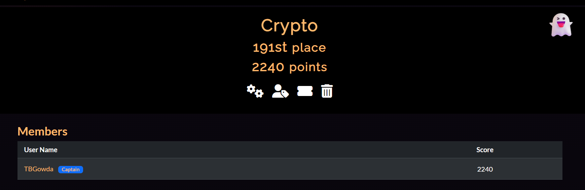

# v1tCTF writeups



## Index / Table of contents

- [v1tCTF Writeups](#v1tctf-writeups)
- [Web](#web-challs)
  - [Login Panel](#login-panel)
  - [Stylish Flag](#stylish-flag)  
  - [Tiny Flag](#tiny-flag)
  - [Mark The Lyrics](#mark-the-lyrics)
- [Osint](#osint)
  - [Among USniversity](#among-usniversity)
  - [Dusk till Duck](#dusk-till-duck)
  - [The Forgotten Inventory](#the-forgotten-inventory)
  - [Duck company](#duck-company)
  - [16th_Duck]( #16_Duck)  
- [Rev](#rev)
  - [Python Obf](#python-obf)
  - [Snail Delivery](#snail-delivery)
  - [Duck RPG](#duck-rpg)
  - [Optimus](#Optimus)
- [Crypto](#crypto)
  - [Modulo Mystery](#modulo-mystery)
  - [Misconfigured RSA](#misconfigured-rsa)
  - [Whitespace](#whitspace)
  - [Shamir's Duck](#shamirs-duck)
- [Misc](#misc)
  - [Talking Duck](#talking-duck)
  - [Emoji Thief](#emoji-thief)
  - [Blank](#blank)
  - [Polyglot](#polyglot)
- [PWN](#pwn)
  - [Waddler](#waddler)
- [Duck](#duck)
  - [Rules](#rules-flag)
  - [Duck robots](#duck-robots)
  - [Feedback](#feedback)
  - [ShoutOut](#shoutout)


  # Web Challenges

  ## Login Panel
   - Used inspect website source
   - The webiste encodes the entered *USERNAME* and *PASSWORD* using *SHA256* and compares with the below two hashes.
   - Seeing the code the following two hashes were found.
    ```
    ajnsdjkamsf ='ba773c013e5c07e8831bdb2f1cee06f349ea1da550ef4766f5e7f7ec842d836e'
    lanfffiewnu = '48d2a5bbcf422ccd1b69e2a82fb90bafb52384953e77e304bef856084be052b6'
    ```
    - Decoding them using a online tool (https://www.dcode.fr/sha256-hash)
    ```
    ajnsdjkamsf ='v1t'        -> USERNAME
    lanfffiewnu = 'p4ssw0rd'  -> PASSWORD
    ```
    - Entering the above *USERNAME* and *PASSWORD* we get the required flag.


  ### Flag:
        v1t{p4ssw0rd}


  ## Stylish Flag
   -  Used inspect website source.
   -  The ```<div hidden class="flag"></div>``` had the pixels which when rendered display the flag.
   - The **css.css** in source contained the pixels of the flag.
   - Used the pixels to see the flag.

  ### Flag:
        v1t{H1D30UT_CSS}

    ## Tiny Flag
    - Viewed website's source page.
    - clicked on 'favicon.ico' in the page which gave a image with the flag present in it.

  ### Flag:
        v1t{t1ny_ico}   

  
  ## Mark The Lyrics
    - Opened the source file.
    - Found that the contents in <mark.>..</mark.> tag contained the parts of the flag.
    ```
    <mark>V</mark>
    <mark>1</mark>
    <mark>T</mark>
    <mark>{</mark>
    <mark>MCK</mark>
    <mark>-pap-</mark>
    <mark>cool</mark>
    <mark>-ooh-</mark>
    <mark>yeah</mark>
    <mark>}</mark>

    ```
    - Manually combined each part to get the final flag.


  ### Flag:
        v1t{MCK-pap-cool-ooh-yeah}
 


# Osint

  ## Among USniversity
   - Searched the image online using google.
   - Found the university's name as *University of Information Technology*.
  ### Flag:
        v1t{UIT}
 
  ## Dusk Till Duck 
  - Used https://tineye.com/ to search the image.
  - Found the exact image on istock where the location was mentioned as *London ON Canada*
  - Tried all parks in London did not work.
  - Later found that the pic was taken in Canada in *Ivey Park* 
  ### Flag:
        v1t{Ivey_Park}

  ## The Forgotten Inventory
  - Clue was given in the description of the challenge.
  ```
  Clue: "CSV" "military equipment" "2007" "Operation Iraqi Freedom"
  ```
  - Searching the above clues online found the website that contained the csv.
```
https://wikileaks.org/wiki/Iraq.xls
```
  - Email found in the csv : david.j.hoskins@us.army.mil
  ### Flag:
        v1t{david.j.hoskins@us.army.mil}
  ## Duck Company
  - Searched the image online using google.
  - Found the exact website selling the product.
  - Website link : https://www.dcuk.com/
  ### Flag:
    v1t{dcuk_com}

  ## 16th Duck
  - Searched the medal pic online and found a website selling it.
  - Obtained the UNIT number it belongs to (Unit 61608).
  - Searched for the Unit 61608 base location.
  - Found the below webiste which had the required coordinates.
  ```
    https://covertaccessteam.substack.com/preading-the-badges-how-osint-mapped
  ```
  ### Flag:
    v1t{55.592169,37.689097}

    
